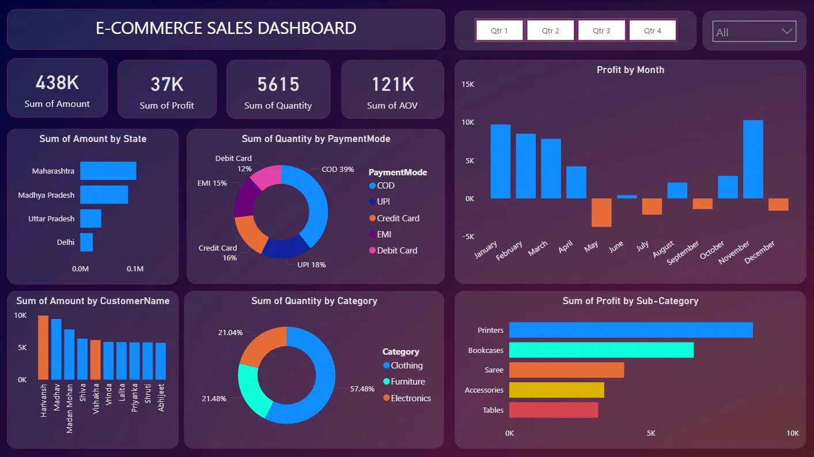

# E-Commerce Sales Dashboard — Power BI

## Dashboard Preview

## Overview
An interactive Power BI dashboard analyzing e-commerce sales performance
across customers, categories, states, and payment modes.

## Key Metrics
- Total Sales Amount: 438K
- Total Profit: 37K
- Total Quantity: 5615
- Sum of AOV: 121K

## Visuals Included
- Profit by Month (Bar Chart)
- Sum of Amount by State (Bar Chart)
- Sum of Quantity by PaymentMode (Donut Chart)
- Sum of Amount by CustomerName (Bar Chart)
- Sum of Quantity by Category (Donut Chart)
- Sum of Profit by Sub-Category (Bar Chart)

## Tools Used
- Microsoft Power BI Desktop
- DAX Measures
- Data Visualization

## Dataset
- Orders.csv
- Details.csv
